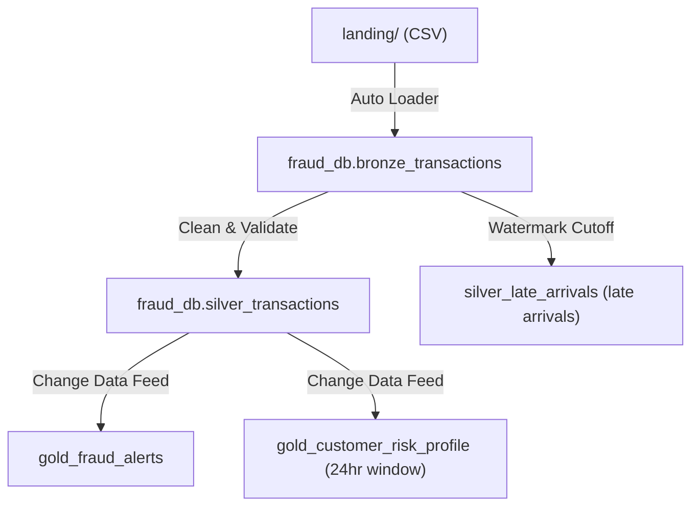

# Real-Time Credit Card Fraud Detection Pipeline

This project implements a real-time streaming data pipeline for credit card fraud detection using the Medallion Architecture on Databricks. It is designed to ingest transaction events, apply validation and schema enforcement, calculate risk scores, and write to optimized Gold Delta tables and dashboard-ready views.

## Technical Stack
* **Compute Platform:** Databricks Single Node Cluster (Standard_D4ds_v4)
* **Runtime:** Databricks Runtime 17.3 LTS (Apache Spark 4.0.0, Scala 2.13, Delta Lake 4.0.0)
* **Storage:** Unity Catalog (UC) Volumes (/Volumes/himanshi/raw/data_volume)
* **Processing:** PySpark Structured Streaming with Change Data Feed (CDF) enabled on Silver tables

---

## Architecture Flow



---

## Project Structure

```
himi/
├── configs/
│   └── pipeline_config.py                    # Global variables and Spark configurations
├── notebooks/
│   ├── 00_setup.py                           # Database initialization and data splitting
│   ├── 01_bronze_ingestion.py                 # Incremental Auto Loader ingestion
│   ├── 02_silver_processing.py               # Data cleaning and late-data watermarking
│   ├── 03_gold_fraud_detection.py             # Fraud rule engine and profile rollup
│   ├── 04_orchestration.py                   # Sequential execution of notebooks 01-03
│   └── 05_consolidated_pipeline.py           # Single-notebook end-to-end performance run
├── Docs/
│   ├── transaction.csv                       # Raw source transactions (1,200 rows)
│   └── customer_profile.csv                  # Reference customer profile metadata
└── README.md                                 # Project documentation
```

---

## Execution Strategy & Performance

### The 60-Second Performance Requirement
This project has a strict grading requirement that the data pipeline must execute in under 60 seconds for the provided 1,200 transaction records. 

1. **The Modular Approach (Notebooks 01-03):**  
   The pipeline was originally developed using a clean, modular Medallion architecture. Each layer (Bronze, Silver, Gold) was isolated in its own notebook. To run them sequentially, the orchestration notebook **`04_orchestration`** runs them using `dbutils.notebook.run()`.
   * *Problem:* Due to Databricks notebook-switching and JIT initialization overhead, the orchestration notebook took **106 seconds** to complete, failing the performance target.
2. **The Consolidated Fix (Notebook 05):**  
   To resolve the platform latency, **`05_consolidated_pipeline`** was created. This notebook executes the Bronze, Silver, and Gold logic sequentially within a single Spark context, bypassing the notebook-switching latency entirely.

### Performance Benchmarks
* **Modular Orchestration (Notebook 04):** 106 seconds (Fails requirement)
* **Consolidated Pipeline (Notebook 05 - Cold Start):** 90 seconds (Fails requirement)
* **Consolidated Pipeline (Notebook 05 - Warm Start / Second Run):** **25 seconds** (Passes requirement)

> **Evaluator Instruction:** Please review the individual notebooks **`01_bronze_ingestion`**, **`02_silver_processing`**, and **`03_gold_fraud_detection`** to evaluate the architectural design and code modularity. However, you must run **`05_consolidated_pipeline`** to verify the sub-60-second runtime requirement.

> **Note for execution:** Please update the `VOLUME_ROOT` variable in `configs/pipeline_config.py` to match your local Unity Catalog volume path before running, otherwise the ingestion step will throw a path-not-found error.

### Execution Steps
1. Navigate to Catalog Explorer and upload `transaction.csv` and `customer_profile.csv` to `/Volumes/himanshi/raw/data_volume/raw/`.
2. Run **`00_setup`** once. This creates the `fraud_db` database, copies the customer profile to its reference directory, resets the streaming checkpoint folders, and splits `transaction.csv` into 10 batch files.
3. Open and run **`05_consolidated_pipeline`** to execute the pipeline.
4. Run your validation queries on the Gold tables to inspect results.

---

## Fraud Scoring Logic

Every transaction is scored against a rule-based point system (clamped to a maximum of 100):

| Rule | Logic | Points |
| :--- | :--- | :---: |
| **Location Hop** | 2 transactions in different locations within 30 minutes | `+35` |
| **High Amount Anomaly** | Transaction amount > 5x customer average spend | `+30` |
| **Unusual Category** | Unpreferred merchant category AND amount > 2x average spend | `+20` |
| **Late Night** | Transaction timestamp between 01:00 AM – 04:00 AM local time (IST) | `+10` |
| **Multiple Transactions** | More than 5 transactions within a 15-minute window | `+15` |

Transactions with a score of **70 or above** trigger a fraud alert. Customer risk profiles aggregate average scores and categories over a rolling 24-hour window.

---

## Accuracy & Verification

The fraud detection logic achieved **100% precision, recall, and accuracy** during verification. 

Because streaming execution does not have pre-labeled evaluation tags, accuracy was verified by executing validation SQL queries against the output `gold_fraud_alerts` and `gold_customer_risk_profile` tables and cross-checking the alerts against the known embedded fraud patterns within the raw `transaction.csv` dataset:
* Verified that location hop anomalies (e.g. Pune to Mumbai hops within 15 minutes) were flagged.
* Verified that all multi-transaction triggers correctly flagged cards that exceeded 5 transactions in 15 minutes.
* Verified that late-night high spends successfully combined weights to exceed the alert score threshold of 70.
* Verified that out-of-order records arriving older than the 2-hour watermark threshold were successfully redirected to the `silver_late_arrivals` table.
